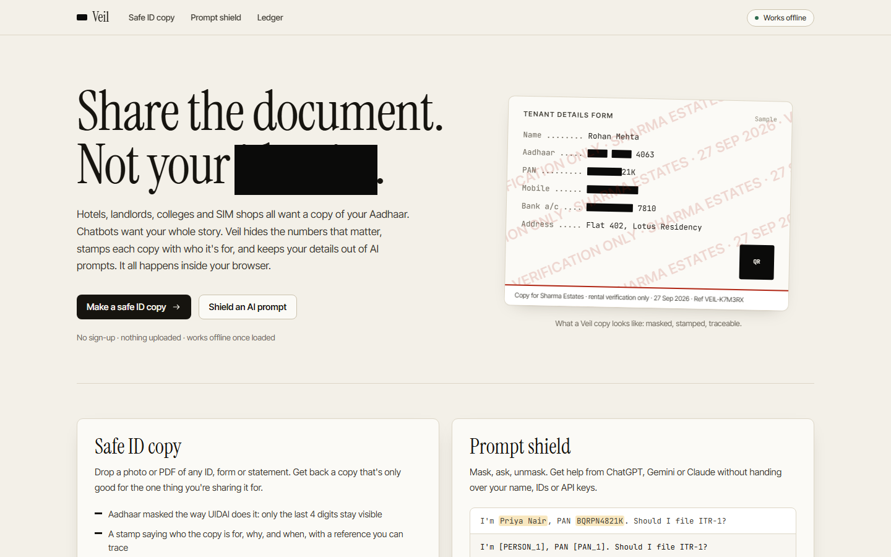
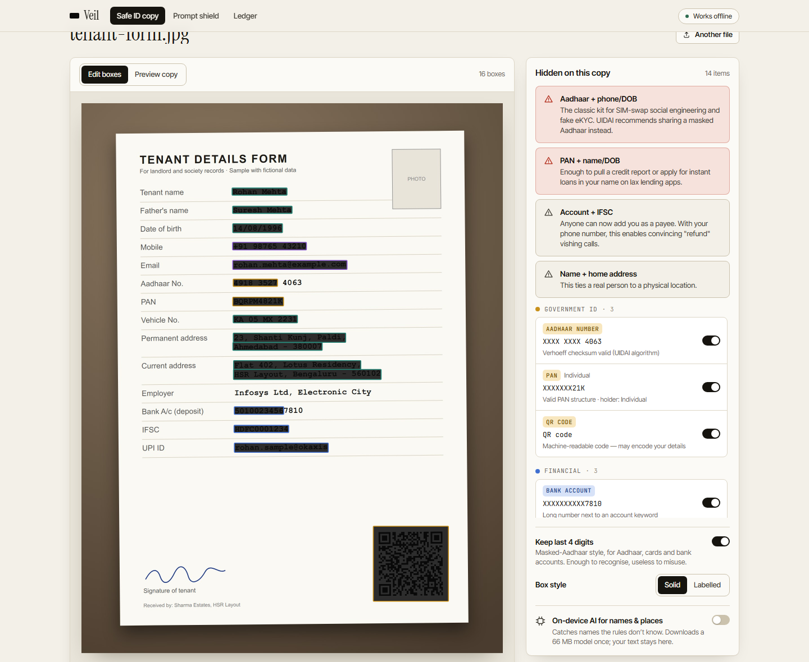
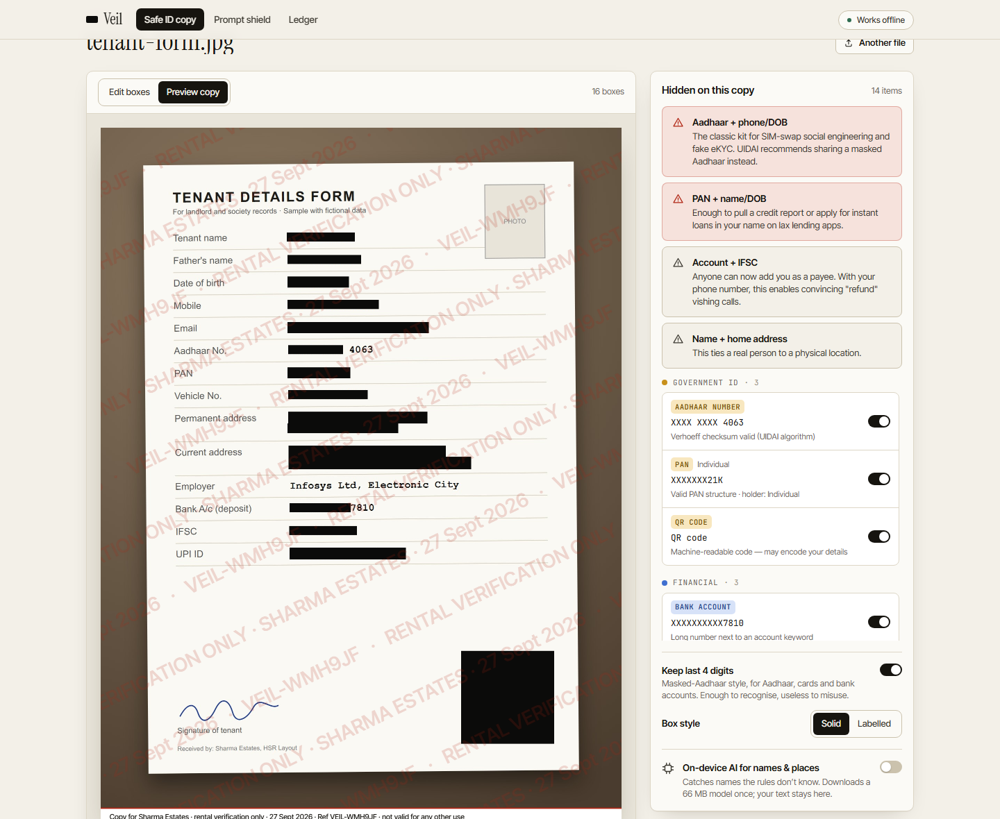
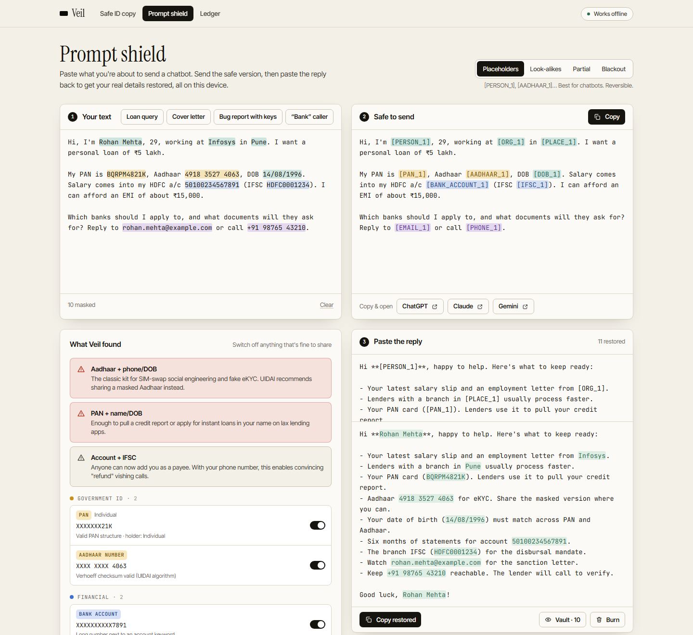
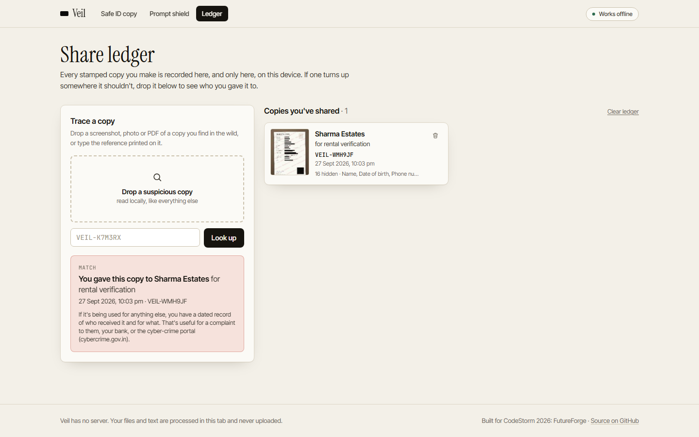
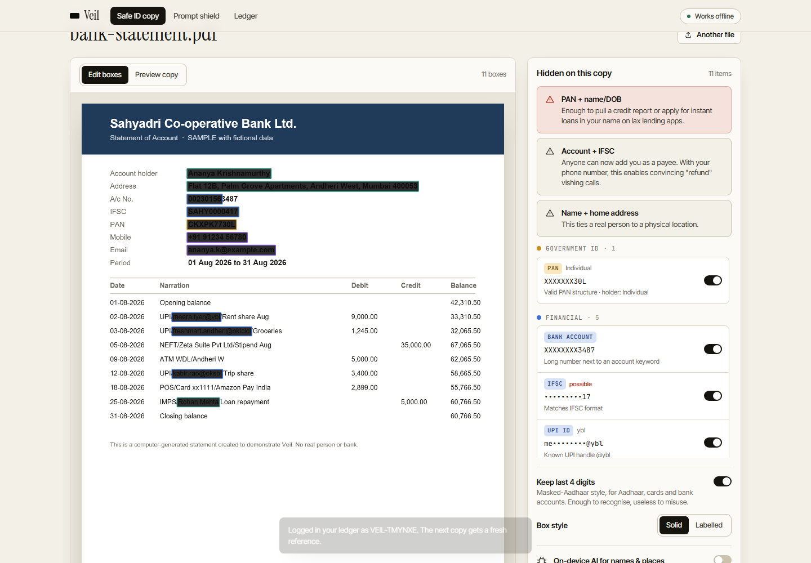

# Veil

**Share the document. Not your identity.**

Veil is a privacy tool that runs entirely in your browser. It does three things:

1. **Safe ID copy.** Drop a photo or PDF of an Aadhaar, PAN, rent agreement, payslip or bank statement. Veil reads it on your device, masks what the other side doesn't need (Aadhaar the way UIDAI does it: only the last 4 digits stay visible), blacks out QR codes, strips GPS and camera metadata, and stamps the copy with who it's for and why.
2. **Share ledger.** Every stamped copy gets a reference like `VEIL-K7M3RX`, recorded only on your device. If a copy turns up somewhere it shouldn't, drop it into Veil: it reads the reference off the image and tells you who you gave it to.
3. **Prompt shield.** Paste what you're about to send to ChatGPT, Gemini or Claude. Names, IDs, phone numbers, API keys and OTPs become `[PERSON_1]`, `[PAN_1]`, `[SECRET_1]`. Paste the chatbot's reply back and Veil restores the real values, locally.

**Live:** https://satanrayshe.github.io/veil/ · **Demo video (1 min):** https://satanrayshe.github.io/veil/demo.mp4 · no sign-up · works offline after the first visit

Built for **CodeStorm 2026: FutureForge**.



## Why

In India, a photocopy of your Aadhaar is the price of a hotel room, a SIM card, a rental, a gym membership. Those copies sit in drawers and WhatsApp chats forever, full-number, with your photo, address and the QR code that encodes all of it. Meanwhile people paste loan questions, cover letters and `.env` files straight into chatbots.

The Digital Personal Data Protection Act, 2023 is built on collecting only what a purpose needs. Veil puts that into practice on the sharer's side.

## What it looks like

| Safe ID copy | Stamped result |
| --- | --- |
|  |  |

| Prompt shield (with on-device AI) | Tracing a leaked copy |
| --- | --- |
|  |  |

Digital PDFs use the real text layer, so boxes land exactly, even on a UPI ID in the middle of a transaction narration:



## Checks, not guesses

Most identifiers carry their own proof. Veil verifies it, so an order number isn't mistaken for your Aadhaar and your Aadhaar doesn't slip through.

| Identifier | How Veil checks it |
| --- | --- |
| Aadhaar, VID | Verhoeff checksum (UIDAI's algorithm), no 0/1 prefix; checksum failures only flagged next to the word "Aadhaar" |
| PAN | 10-character structure with a valid holder-type letter (P, C, H, F, A, T, B, L, J, G) |
| GSTIN | State code, embedded PAN and the mod-36 check character |
| Cards, CVV | Luhn checksum plus network (RuPay, Visa, Mastercard, Amex…) |
| Bank account, IFSC | Account keywords nearby; IFSC matched to 42 banks |
| UPI ID | 75 bank handles (`@okaxis`, `@ybl`, `@paytm`…), kept distinct from email |
| Phone, email | Indian mobiles in any format (`+91`, `0`-prefixed, spaced), international numbers |
| Passport, voter ID, DL, vehicle | Indian formats, confirmed by the surrounding words |
| OTPs, passwords | "OTP is 482913", "password: …", `KEY=value` in configs (placeholders like `your_api_key_here` ignored) |
| API keys, secrets | 22 formats: OpenAI, Anthropic, GitHub, GitLab, AWS, Google, Slack, Stripe, Razorpay, Hugging Face, npm, SendGrid, Twilio, Telegram, Discord, JWTs, private keys, database URLs |
| Names, addresses, DOB | Context cues ("Name:", "S/O", "Regards,"), a 660-name dictionary, address labels up to the PIN code, and name propagation (once "Rohan Mehta" is found, a later "Rohan" is masked too) |
| Names, places, organisations (optional) | DistilBERT NER running in a web worker via transformers.js (66 MB, downloaded once) |
| QR codes | Found with jsQR and blacked out; a squareness and module-density check rejects table rulings |

Veil also explains **combinations**: Aadhaar + phone is a SIM-swap kit, PAN + DOB is enough for instant-loan fraud, an OTP in a message is always a red flag.

## Private because there's nowhere to send it

- **No server.** Veil is a static site. OCR (Tesseract, self-hosted), PDF parsing (pdf.js), detection, and the optional AI model all run in the tab.
- **Works offline.** A service worker caches the app and, once it's in control, the OCR engine variant your browser will use. Turn off Wi-Fi and it keeps working, which is the easiest proof that nothing is sent anywhere.
- **Real redaction.** Exports are redrawn from pixels: no text layer under the black boxes, no EXIF/GPS, and PDFs are rebuilt from page images. There's no blur option, because blurred or pixelated text can often be recovered.
- **Reversible masking stays local.** The placeholder-to-value vault lives in the tab's session storage and can be burned with one click.

## Run it

```bash
npm install
npm run dev        # copies the OCR engine into public/ and starts Vite
npm test           # 28 unit tests for validators, detection and mask/unmask
npm run build      # production build + service worker
npm run assets     # regenerate sample documents and icons (Playwright)
```

End-to-end checks (Playwright, against `npm run preview`): `node e2e/flow.mjs`, `node e2e/offline.mjs`, `node e2e/ai.mjs`.

## How it's built

- React 19, TypeScript, Vite 8, Tailwind CSS 4
- `tesseract.js` 7 with self-hosted LSTM cores and `eng` data
- `pdfjs-dist` for rendering and text-layer word boxes (glyph advances measured so partial-word boxes line up)
- `pdf-lib` to rebuild flattened PDFs, `exifr` to show what metadata is being removed
- `jsqr` for QR detection
- `@huggingface/transformers` for the optional NER model (`onnx-community/distilbert-NER-ONNX`, q8)
- `vite-plugin-pwa` / Workbox for offline

```
src/lib/detect   validators (Verhoeff, Luhn, GSTIN mod-36, PAN), rules, names, engine, mask/unmask vault
src/lib/doc      load (image/PDF/EXIF), OCR, layout (findings → boxes), QR, render (burn-in, stamp, export)
src/lib/ai       NER web worker + client
src/lib/ledger   on-device share ledger and OCR-tolerant reference lookup
src/pages        Home, Safe ID copy, Prompt shield, Ledger
```

## Limits

- OCR is English-only for now; Hindi and regional-language text is not read (numbers still are).
- Name detection without the AI model relies on cues and a dictionary, so unusual names in free text can slip through. Every document view lets you click any word or drag a box to hide it.
- The ledger lives in your browser's storage. Clearing site data deletes it.
- A stamp discourages misuse and makes it traceable; it can't make a copy impossible to misuse.

## Demo data

Every name, number and address in the samples is fictional. The sample Aadhaar number is generated to pass the checksum; key-shaped strings in the samples are assembled at runtime so secret scanners don't mistake them for real credentials.

## License

MIT
